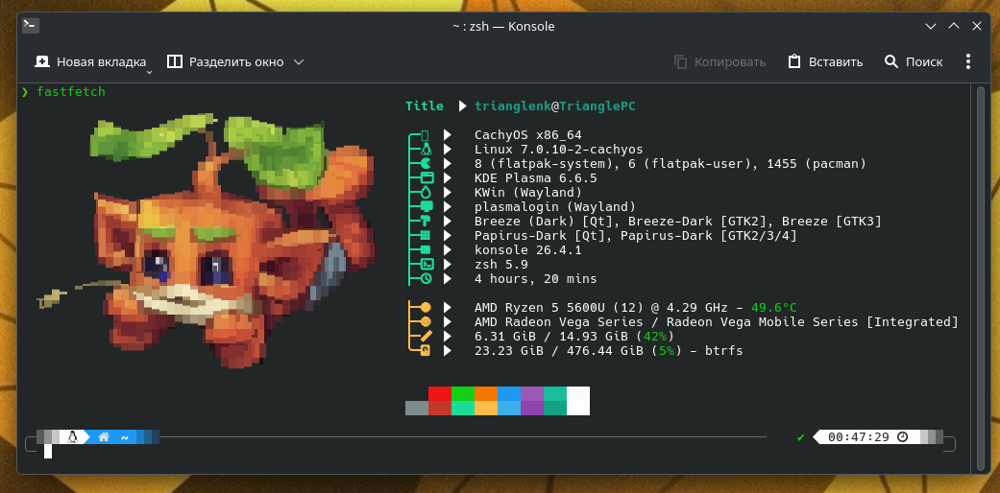

# 🚀 Fastfetch Kwéebecs Customization



> **Кастомная конфигурация для [fastfetch](https://github.com/fastfetch-cli/fastfetch)** — современной альтернативы `neofetch`, написанной на C. Включает **персональный логотип**, оптимизированный конфиг и автоматическую установку.

---

## ✨ Особенности

✅ **Быстрый вывод информации** о системе
✅ **Кастомный логотип** (`fastfetch/logo.png`)
✅ **Детальная информация**: OS, ядро, пакеты, оболочка, DE/WM, тема, иконки
✅ **Поддержка цветовой схемы** терминала
✅ **Лёгкая настройка** под себя
✅ **Работает в Bash и Zsh**

---

## 🖼️ Кастомный логотип

Логотип проекта хранится в файле:
**`fastfetch_Kwéebecs/fastfetch/logo.png`**


---

## 📸 Пример вывода

```plaintext
╭────────────────────────────────────────────────────────────╮
│                   🄿🅄🅁🅁🅁🅄🅁🅁🅄                          │
│                                                           │
╰────────────────────────────────────────────────────────────╯
   user@host
  ────────────────────────────────────────────────────────────
  OS: Arch Linux x86_64
  Kernel: 6.8.1-arch1-1
  Uptime: 2 hours, 30 mins
  Shell: zsh 5.9
  CPU: AMD Ryzen 7 (16) @ 3.6GHz
  GPU: NVIDIA RTX 3060
  Memory: 4.2GiB / 15.5GiB
  Disk: 256GB / 1TB
  ────────────────────────────────────────────────────────────
